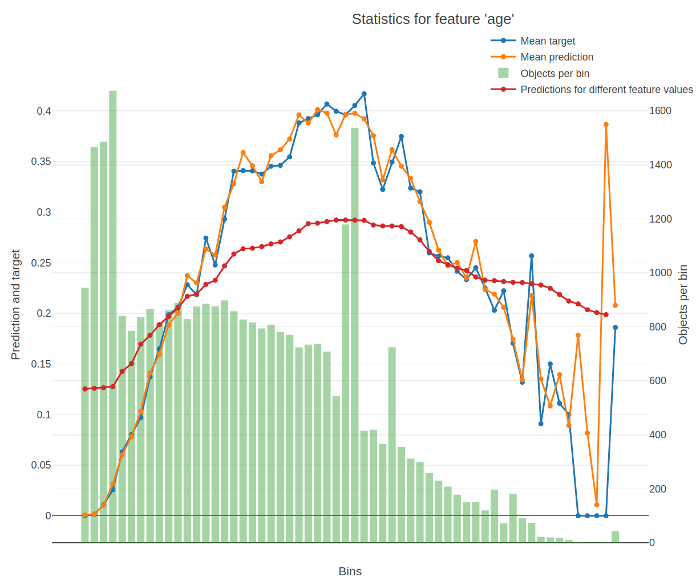

Calculate and plot a set of statistics for the chosen feature.

An example of plotted statistics:

The X-axis of the resulting chart contains values of the feature divided into buckets. For numerical features, the splits between buckets represent conditions (`feature < value`) from the trees of the model. For categorical features, each bucket stands for a category.

The Y-axis of the resulting chart contains the following graphs:

- 

- 

- 

- 

The return value of the function contains the data from these graps.

The following information is used for calculation:

- Trained model
- Dataset
- Label values



- Only models with [one-hot encoded](../../../concepts/parameter-tuning.md) categorical features are supported. Set the `one_hot_max_size` parameter to a large value to ensure that one-hot encoding is applied to all categorical features in the model.
- Multiclassification modes are not supported.



